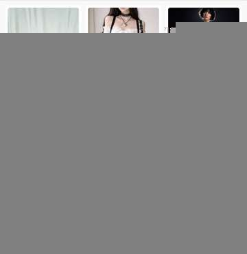

# Weili Fashion Try-On Scene Batch

<p align="center">
  <a href="#中文">中文</a> ·
  <a href="#english">English</a> ·
  <a href="#日本語">日本語</a> ·
  <a href="#한국어">한국어</a> ·
  <a href="#français">Français</a> ·
  <a href="#español">Español</a>
</p>

Selectable AI fashion try-on skill for Codex. Upload a model photo and a garment photo, choose from 30 scene options, then generate 1, 4, or 9 try-on images in 3:4, 9:16, or 1:1.

## Case Gallery

The public case below includes the model reference, garment reference, and four generated 9:16 outputs.

<p align="center">
  
</p>

Case settings:

```text
Scene numbers: 3,14,25,27
Image count: 4
Aspect ratio: 9:16
```

## 中文

`weili-fashion-tryon-scene-batch` 是一个 Codex 服装换装 skill：用户上传模特图和服装图后，先展示 30 个候选场景，再让用户选择场景编号、出图数量和画幅比例，最后生成换装图。

核心能力：

- 保持模特身份、脸部、发型、肤色、体型和姿态逻辑。
- 尽量忠实还原服装廓形、材质、颜色、领口、袖口、下摆、纽扣、缝线和合身关系。
- 支持 30 个候选场景选择。
- 支持出图数量：1 / 4 / 9。
- 支持画幅比例：3:4 / 9:16 / 1:1。
- 支持中文、英文、双语和自动语言模式。

安装：

```bash
mkdir -p ~/.codex/skills
cp -R weili-fashion-tryon-scene-batch ~/.codex/skills/
```

调用：

```text
$weili-fashion-tryon-scene-batch
```

示例输入：

```text
场景编号：3,14,25,27；图片数量：4；画幅比例：9:16
```

## English

`weili-fashion-tryon-scene-batch` is a Codex skill for fashion virtual try-on. It takes a model reference and a garment reference, presents 30 selectable scene candidates, then generates final try-on images based on the chosen scene numbers, image count, and aspect ratio.

Key features:

- Preserves model identity, face, hair, skin tone, body proportions, and pose family.
- Transfers garment silhouette, material, color, neckline, sleeves, hem, buttons, seams, and fit.
- Shows 30 selectable candidate scenes before generation.
- Supports image counts: 1 / 4 / 9.
- Supports aspect ratios: 3:4 / 9:16 / 1:1.
- Supports Chinese, English, bilingual, and auto language modes.

Install:

```bash
mkdir -p ~/.codex/skills
cp -R weili-fashion-tryon-scene-batch ~/.codex/skills/
```

Invoke:

```text
$weili-fashion-tryon-scene-batch
```

Example request:

```text
Scene numbers: 3,14,25,27; image count: 4; aspect ratio: 9:16
```

## 日本語

`weili-fashion-tryon-scene-batch` は Codex 用のファッション試着 skill です。モデル画像と服の画像を入力し、30 個の候補シーンから選択したあと、指定した枚数と比率で試着画像を生成します。

主な機能：

- モデルの顔、髪型、肌色、体型、雰囲気を保ちます。
- 服のシルエット、素材、色、襟、袖、裾、ボタン、縫い目、フィット感を保つように生成します。
- 生成前に 30 個の候補シーンを提示します。
- 画像枚数：1 / 4 / 9。
- 比率：3:4 / 9:16 / 1:1。
- 中国語、英語、バイリンガル、自動言語モードに対応します。

インストール：

```bash
mkdir -p ~/.codex/skills
cp -R weili-fashion-tryon-scene-batch ~/.codex/skills/
```

呼び出し：

```text
$weili-fashion-tryon-scene-batch
```

例：

```text
シーン番号：3,14,25,27；画像枚数：4；比率：9:16
```

## 한국어

`weili-fashion-tryon-scene-batch`는 Codex용 패션 가상 피팅 skill입니다. 모델 사진과 의상 사진을 입력하면 30개의 후보 장면을 먼저 보여주고, 사용자가 선택한 장면 번호, 이미지 수, 화면 비율에 맞춰 결과 이미지를 생성합니다.

주요 기능:

- 모델의 얼굴, 헤어, 피부 톤, 체형, 포즈 분위기를 유지합니다.
- 의상의 실루엣, 소재, 색상, 네크라인, 소매, 밑단, 단추, 봉제선, 핏을 보존합니다.
- 생성 전에 30개의 후보 장면을 제공합니다.
- 이미지 수: 1 / 4 / 9.
- 화면 비율: 3:4 / 9:16 / 1:1.
- 중국어, 영어, 이중 언어, 자동 언어 모드를 지원합니다.

설치:

```bash
mkdir -p ~/.codex/skills
cp -R weili-fashion-tryon-scene-batch ~/.codex/skills/
```

실행:

```text
$weili-fashion-tryon-scene-batch
```

예시:

```text
장면 번호: 3,14,25,27; 이미지 수: 4; 화면 비율: 9:16
```

## Français

`weili-fashion-tryon-scene-batch` est une compétence Codex pour l'essayage virtuel de mode. Elle utilise une photo de modèle et une photo de vêtement, propose 30 scènes au choix, puis génère les images finales selon les scènes, le nombre d'images et le ratio sélectionnés.

Fonctions principales :

- Préserve l'identité du modèle, le visage, les cheveux, le teint, les proportions et la famille de pose.
- Transfère la silhouette, la matière, la couleur, l'encolure, les manches, l'ourlet, les boutons, les coutures et l'ajustement du vêtement.
- Affiche 30 scènes candidates avant la génération.
- Nombre d'images : 1 / 4 / 9.
- Ratios : 3:4 / 9:16 / 1:1.
- Prend en charge les modes chinois, anglais, bilingue et automatique.

Installation :

```bash
mkdir -p ~/.codex/skills
cp -R weili-fashion-tryon-scene-batch ~/.codex/skills/
```

Utilisation :

```text
$weili-fashion-tryon-scene-batch
```

Exemple :

```text
Numéros de scène : 3,14,25,27 ; nombre d'images : 4 ; ratio : 9:16
```

## Español

`weili-fashion-tryon-scene-batch` es una skill de Codex para prueba virtual de moda. Usa una foto de modelo y una foto de prenda, muestra 30 escenas seleccionables y genera las imágenes finales según los números de escena, la cantidad de imágenes y la proporción elegida.

Funciones principales:

- Conserva identidad, rostro, cabello, tono de piel, proporciones corporales y familia de pose del modelo.
- Transfiere silueta, material, color, escote, mangas, bajo, botones, costuras y ajuste de la prenda.
- Muestra 30 escenas candidatas antes de generar.
- Cantidad de imágenes: 1 / 4 / 9.
- Proporciones: 3:4 / 9:16 / 1:1.
- Soporta modos chino, inglés, bilingüe y automático.

Instalación:

```bash
mkdir -p ~/.codex/skills
cp -R weili-fashion-tryon-scene-batch ~/.codex/skills/
```

Uso:

```text
$weili-fashion-tryon-scene-batch
```

Ejemplo:

```text
Números de escena: 3,14,25,27; cantidad de imágenes: 4; proporción: 9:16
```

## Repository Structure

```text
weili-fashion-tryon-scene-batch/
├── SKILL.md
├── agents/
│   └── openai.yaml
├── examples/
│   ├── case-01-assets/
│   │   └── case-01-gallery-readme.jpeg
│   └── case-01-selected-scenes.md
├── references/
│   ├── prompting.md
│   └── scene-bank.json
└── scripts/
    └── select_scenes.py
```
